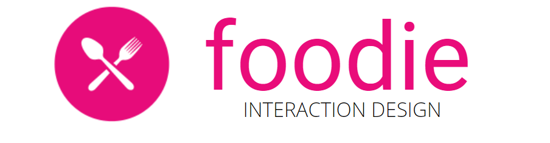
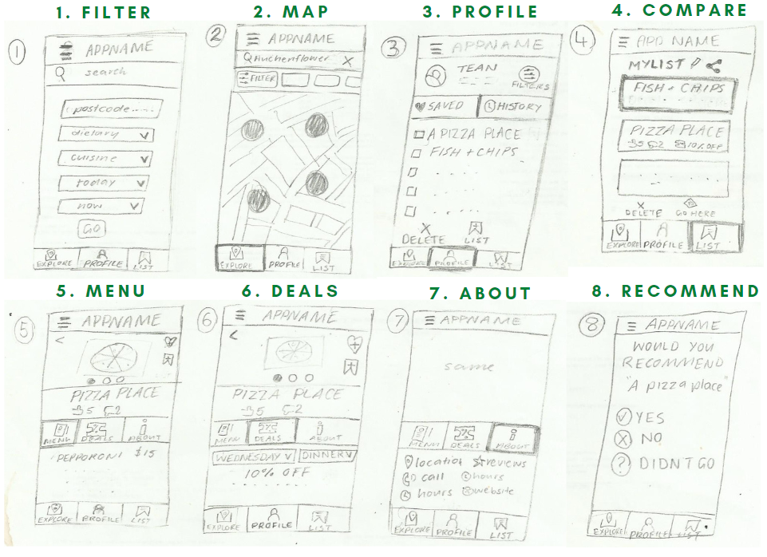
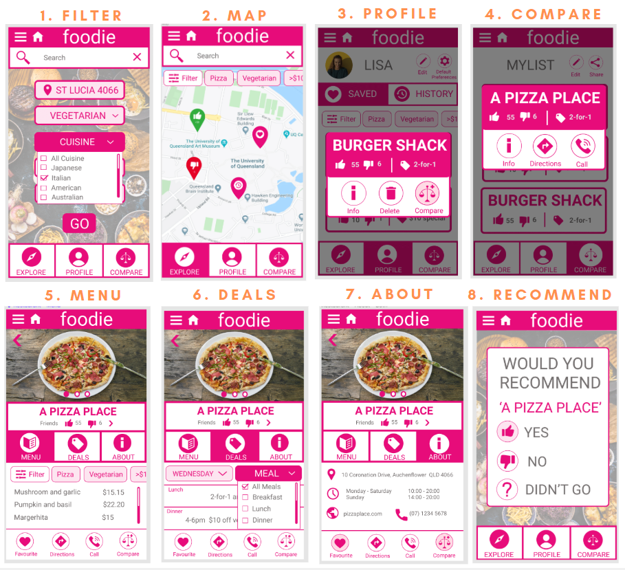

The aim of the project was to use user experience and design principles to create an application. 'Foodie' is a mobile application to assist users with deciding where to dine out. A mind map and presentation was submitted as a proposal of the application and low-fidelity prototype. From here three iterations of the design process were performed and documented in a final report.

### CONCEPTUAL DESGIN

# LOW FIDELITY

# MEDIUM FIDELITY

# HIGH FIDELITY

